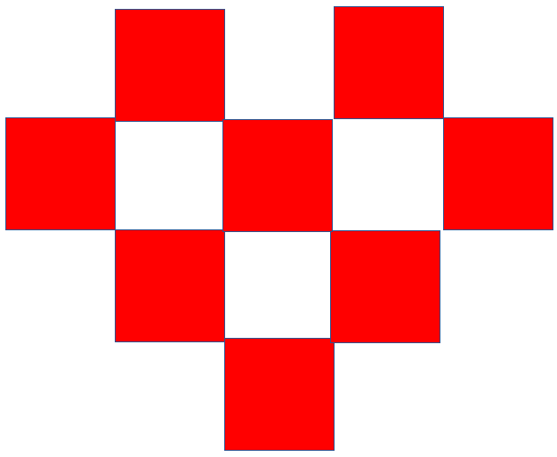
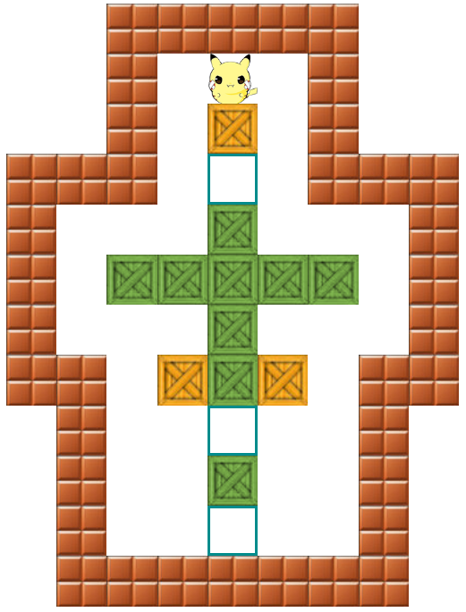

1. for和while的相互转换
```js
- 将下边的 for 转化为 while
    for(var i = 0; i < 5; i++) {
        if(i > 3) {
            break;
        }
        console.log(i)
    }
⭐⭐⭐⭐⭐⭐⭐⭐⭐⭐⭐⭐⭐⭐⭐⭐⭐⭐⭐⭐⭐⭐⭐⭐
- 将下边的 while 转化为 for
    var i = 0, j = 3;
    while(i+j<10) {
        console.log(i);
        console.log(j);
        i++;
        j += i;
    }
```
2. 回答：continue和break的区别，可以举生活中的例子，或代码例子都可以，或者直接说区别

3. 回答： for循环括号里的3个表达式都代表什么，是否都可以省略

4. 利用for循环，实现1到100的和

5. 封装一个函数，实现传入一个范围内数字之和
如：getNum(2,5) => 返回14

6. 利用while循环，实现阶乘

7. 利用for循环，遍历出二维矩阵
如果发现是数字类型，打印出来
如果发现是原始类型且非数字类型，则不打印
如果发现是引用类型，则不打印包括该值以及这一行后边的值
如：
[
    [11,22,"abc",33,44,{a:5},55,66],
    [77,function(){}, 88],
    [99,null,100]
    
]
遍历打印的顺序：11 22 33 44 77 99 100

8. 通过映射二维数组和配合dom操作形成❤型
[
    [0,1,0,1,0],
    [1,0,1,0,1],
    [0,1,0,1,0],
    [0,0,1,0,0]
]
效果图：

9. 通过上边❤型的提醒，你是否可以自己设计一个二维数组，然后通过循环渲染出下边效果(里边的图片都在imgs文件夹下)
效果图：


