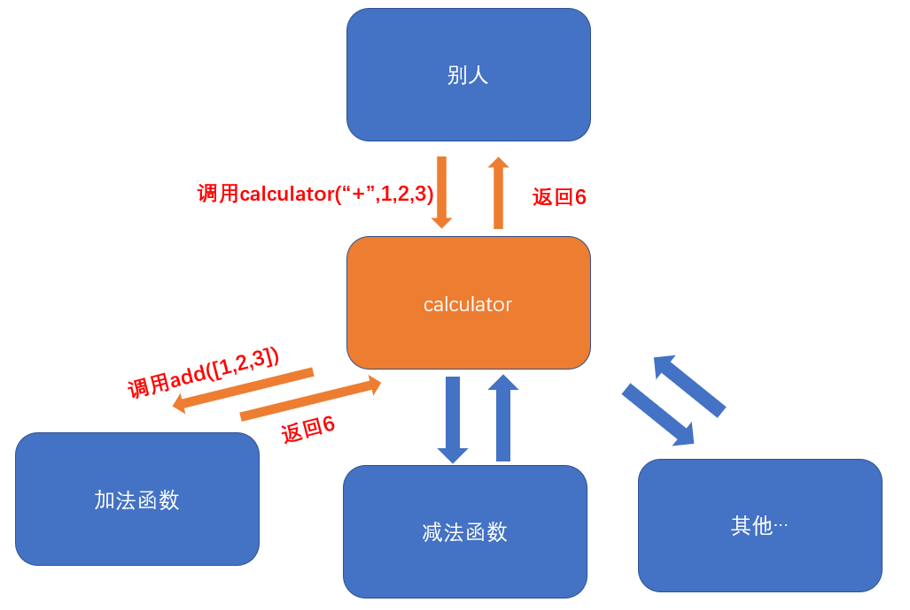

# 小型计算器(Javascript版)

## 1.图解
___


## 2.前置知识
___
##### 1-1.函数基本使用
[链接: 函数详细文档](https://developer.mozilla.org/zh-CN/docs/Web/JavaScript/Reference/Functions)
[链接: arguments详细文档](https://developer.mozilla.org/zh-CN/docs/Web/JavaScript/Reference/Functions/arguments)
- 确定实参个数
```js
例子: 
function add(a,b){
    return a + b;
};
console.log(add(1,2));//返回3
```
- 不确定实参个数(根据函数内部的arguments伪数组获取)
```js
//该例子大致arguments = {"0": 22, "1": 33, "2": 44, length: 3}
function add(){
    var sum = 0;
    for(var i = 0 ; i < arguments.length; i++) {
        sum += arguments[i];
    };
    return sum;
};
console.log(add(22,33,44));//返回99
```
##### 1-2.Array.from可以将类(伪)数组转化为真数组
[链接: Array.from详细文档](https://developer.mozilla.org/zh-CN/docs/Web/JavaScript/Reference/Global_Objects/Array/from)
```js
例子: 
var arraryLike = {
    "0": 11,
    "1": 22,
    "2": 33,
    "length": 3,
}
var arr = Array.from(arraryLike);
arr为: [11,22,33]
```

##### 1-3.slice截取数组,接收1-2个参数,第1个是开始索引,第2个是结束索引
[链接: slice详细文档](https://developer.mozilla.org/zh-CN/docs/Web/JavaScript/Reference/Global_Objects/Array/slice)
```js
例子: 
var arr = [11,22,33,44,55];
var newArr = arr.slice(1);// [22,33,44,55]
var newArr2 = arr.slice(1,3);// [22,33]
```


## 3.完整代码实现
___
**约定**: 先约定好如何**调用**calculator函数是比较**方便**的
**传参**: 1、计算类型: 加法or减法or其他 2、有哪些值
**使用**: 
calculator("+", 1,2,3,4,5,6);返回21
calculator("-", 6,1);返回5

1. **定义calculator函数,写上返回值**
```js
function calculator(){
    var result;
    ...占位代码
    return result;
}
```
2. **完善calculator,取出调用calculator时传的计算类型和值,并根据计算类型判断是不是加法**
```js
function calculator(){
    var result;//计算器最后的返回值
    
    //取出计算类型, 如: type = "+"
    var type = arguments[0];

    //取出计算的值,如: values = [1,2,3];
    var values = Array.from(arguments).slice(1);

    //调用add函数去计算结果
    if(type === "+"){
        result = add(values);
    }

    return result;
}
```
3. **写一个加法函数 add([1,2,3]) 返回6**
```js

function add(argsArr){
    var sum = 0;
    for(var i = 0 ; i < argsArr.length; i++) {
        sum += argsArr[i];
    };
    return sum;
};
```

4. **写一个减法函数 minus([1,2,3]) 返回-4**
```js
function minus(argsArr){
    var sum = 0;
    for(var i = 0 ; i < argsArr.length; i++) {
        if(i >= 1) {
            argsArr[i] = -argsArr[i];
        }
        sum += argsArr[i];
    };
    return sum;
}
```

5. **改善calculator结构,将减法函数添加进去**
```js
function calculator(){
    var result;//计算器最后的返回值
    
    //取出计算类型, 如: type = "+"
    var type = arguments[0];

    //取出计算的值,如: values = [1,2,3];
    var values = Array.from(arguments).slice(1);

    switch(type){
        case "+": 
            result = add(values);
            break;
        case "-": 
            result = minus(values);
            break;
        default: 
            throw new TypeError("不存在该计算类型")
    }

    return result;
}
```

6. **可以自行扩展其他功能,如乘法,然后就可以去写个乘法函数**
```js
function calculator(){
    ...占位代码
    switch(type){
        ...占位代码
        case "*":
            result = multiply(values);
            break;
        default: 
            throw new TypeError("不存在该计算类型")
    }
    return result
}
```


